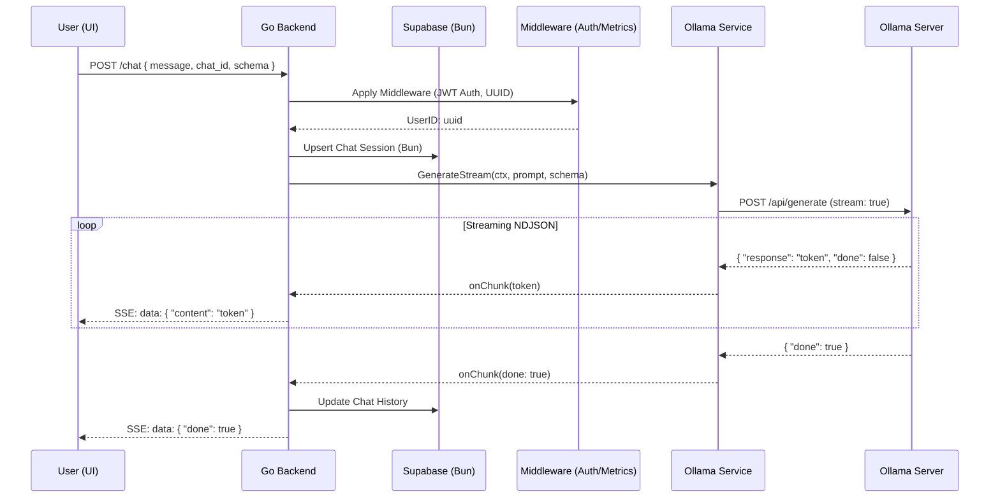

# 🏗️ PromptOps Engine — Architectural Deep Dive

This document explains the internal mechanics of the PromptOps Engine, from request ingestion to streaming LLM responses with observability.

---

## 🏛️ System Overview

PromptOps Engine follows a modular, decoupled architecture designed for high-performance LLM orch1. **Frontend (Next.js)**: A React-based SPA that handles user interaction, SSE stream consumption, and markdown rendering. Uses **AuthContext** for session management.
2. **Backend (Go)**: A modular API server built with `chi`. Entry point at `cmd/api/main.go`.
3. **Identity Layer**: JWT-based authentication with `x/crypto/bcrypt` for secure password hashing.
4. **Data Layer (Supabase/Bun)**: Uses **Bun ORM** to interface with a Supabase PostgreSQL instance. Includes a formal migration system.
5. **Services Layer**: Encapsulates external integrations (Ollama) and business logic (JSON Schema validation).
6. **Inference (Ollama)**: Local LLM server running models like `tinyllama`.

---

## 🔄 Request Lifecycle (The Chat Flow)

### 🗺️ Text-Based Architectural Map

```text
[ USER UI (Next.js) ]
       │
       │ 1. POST /chat (JSON + Bearer Token)
       ▼
[ BACKEND (Go / Chi) ] ───▶ [ MIDDLEWARE ]
       │                        ├─ RequestID (UUID)
       │                        ├─ Auth Check (JWT Validate)
       │                        └─ Metrics Start
       │
[ DATABASE (Supabase) ] ◀───┤ 2. Save Message History
                            │
[ OLLAMA SERVICE ] ◀────────┘
       │
       │ 3. Stream Generation Request
       ▼
[ OLLAMA SERVER ] ───▶ [ LLM MODEL (Llama/Mistral) ]
       │
       │ 4. NDJSON Token Stream
       ▼
[ BACKEND PROCESSING ]
       │
       ├─ If Schema: Buffer & Validate (gojsonschema)
       └─ If Standard: Direct SSE Push
       │
       ▼ 5. Server-Sent Events (SSE)
[ USER UI (Next.js) ]
```

The following sequence diagram provides more technical detail on the timing:



---

## 🔐 Identity & Sessions

PromptOps Engine implements a secure, stateless identity layer:

- **Authentication**: `POST /auth/register` and `POST /auth/login`.
- **JWT**: Tokens are signed using a `JWT_SECRET` and contain `user_id` and `email` claims.
- **Persistence**: Chat history is stored in the `chats` table, indexed by `user_id`, allowing users to resume conversations across devices.
- **ORM (Bun)**: Used for high-performance PostgreSQL interaction with clean model definitions.

---

## 📦 Dependency & Service Rationale

### Go Package Selection

| Package | Role | Rationale ("The Why") |
| :--- | :--- | :--- |
| `github.com/uptrace/bun` | ORM | SQL-first ORM that is significantly faster than GORM and provides better support for PostgreSQL features used in Supabase. |
| `github.com/golang-jwt/jwt` | Identity | The gold standard for JWT implementation in Go. |
| `golang.org/x/crypto` | Security | Used for Bcrypt password hashing. |
| `github.com/go-chi/chi/v5` | Router | chosen for its zero-allocation design and 100% compatibility with `net/http`. |
| `github.com/prometheus/client_golang` | Metrics | The industry standard for cloud-native monitoring. |
| `github.com/xeipuuv/gojsonschema` | Validation | Highly reliable implementation of JSON Schema. |
| `log/slog` (StdLib) | Logging | Native Go structured logging. |
ON-formatted logs that are easily ingested by observability platforms (ELK, Datadog) without third-party dependencies. |

### Internal Service Layer

#### `OllamaClient` (`services/ollama.go`)
Decouples the core API from the LLM provider. It handles the parsing of **NDJSON** streams and records performance metrics at the source. This abstraction makes it easy to switch providers (e.g., to OpenAI or Anthropic) in the future.

#### `JSONValidator` (`services/validator.go`)
Wraps the schema validation logic. By separating this into a service, we keep the HTTP handlers thin and ensure that the validation logic is reusable across different parts of the platform (e.g., for validatng tool outputs).

#### `Metrics Middleware` (`middleware/metrics_middleware.go`)
A non-intrusive way to instrument the entire API. It automatically tracks standard RED metrics (Requests, Errors, Duration) for every endpoint, ensuring total visibility with zero boilerplate in the handler layer.
