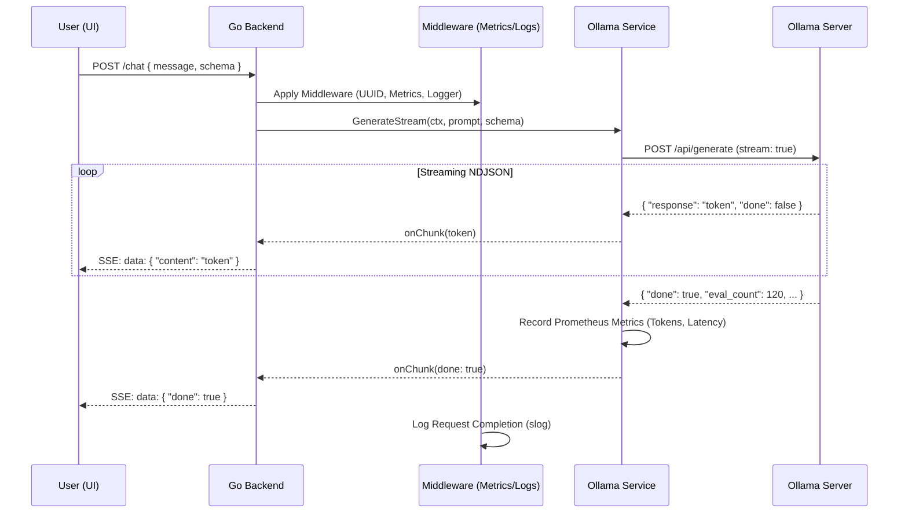

# 🏗️ PromptOps Engine — Architectural Deep Dive

This document explains the internal mechanics of the PromptOps Engine, from request ingestion to streaming LLM responses with observability.

---

## 🏛️ System Overview

PromptOps Engine follows a modular, decoupled architecture designed for high-performance LLM orchestration.

1. **Frontend (Next.js)**: A React-based SPA that handles user interaction, SSE stream consumption, and markdown rendering.
2. **Backend (Go)**: A stateless API server built with `chi` for routing and `slog` for structured observability.
3. **Services Layer**: Encapsulates external integrations (Ollama) and business logic (JSON Schema validation).
4. **Middleware Stack**: Handles cross-cutting concerns (CORS, Monitoring, Tracing).
5. **Inference (Ollama)**: Local LLM server running models like `tinyllama`.

---

## 🔄 Request Lifecycle (The Chat Flow)

### 🗺️ Text-Based Architectural Map

```text
[ USER UI (Next.js) ]
       │
       │ 1. POST /chat (JSON + SSE Request)
       ▼
[ BACKEND (Go / Chi) ] ───▶ [ MIDDLEWARE ]
       │                        ├─ RequestID (UUID)
       │                        ├─ Auth Check
       │                        └─ Metrics Start
       │
[ OLLAMA SERVICE ] ◀───────┘
       │
       │ 2. Stream Generation Request
       ▼
[ OLLAMA SERVER ] ───▶ [ LLM MODEL (Llama/Mistral) ]
       │
       │ 3. NDJSON Token Stream
       ▼
[ BACKEND PROCESSING ]
       │
       ├─ If Schema: Buffer & Validate (gojsonschema)
       └─ If Standard: Direct SSE Push
       │
       ▼ 4. Server-Sent Events (SSE)
[ USER UI (Next.js) ]
```

The following sequence diagram provides more technical detail on the timing:



---

## 🛡️ The Schema Guard Loop

When a user provides a JSON Schema, the engine enters a "Self-Correction Loop":

1. **Inference**: The engine requests a JSON response from Ollama.
2. **Buffering**: Instead of streaming tokens immediately, the backend buffers the full response.
3. **Validation**: The buffered string is validated against the provided schema using `gojsonschema`.
4. **Retry Logic**:
   - **Success**: The valid JSON is streamed to the client as a single event.
   - **Failure**: The error is captured, and a new prompt is sent to Ollama: *"Your last response was invalid JSON. Error: [ERR]. Please try again."*
5. **Circuit Breaker**: The loop terminates after 3 failed attempts to prevent infinite costs/latency.

---

## 📈 Observability Stack

The engine is "Observed by Design":

- **Request ID (X-Request-ID)**: Every request is assigned a unique UUID in the `middleware.Logger`. This ID is injected into the context and propagated to the service layer.
- **Structured Logging**: `slog` output allows for easy parsing by Logstash/Fluentd in production.
- **Prometheus Scaping**: The `:8080/metrics` endpoint provides real-time visibility into LLM usage and system health.

---

## 🔧 Concurrency Model

- **SSE Streaming**: Uses `http.Flusher` to push data as it arrives, avoiding memory buffering for non-schema requests.
- **Context Propagation**: We use `context.Context` everywhere to ensure that if a user cancels a request (closes the browser), the connection to Ollama is immediately terminated.
- **Thread Safety**: Prometheus counters are thread-safe and atomic, allowing high-concurrency tracking without performance degradation.

---

## 📦 Dependency & Service Rationale

### Go Package Selection

| Package | Role | Rationale ("The Why") |
| :--- | :--- | :--- |
| `github.com/go-chi/chi/v5` | Router | Chosen for its zero-allocation design and 100% compatibility with `net/http`. It provides the speed needed for real-time streaming without the bloat of larger frameworks. |
| `github.com/prometheus/client_golang` | Metrics | The industry standard for cloud-native monitoring. It allows us to export high-granularity metrics (like token counts) to Prometheus and Grafana. |
| `github.com/google/uuid` | Tracing | Used to generate `request_id`. Essential for correlating logs in distributed environments or high-concurrency scenarios. |
| `github.com/xeipuuv/gojsonschema` | Validation | Highly reliable implementation of JSON Schema (Draft 4/6/7). Necessary for the **Schema Guard** feature to enforce structured LLM output. |
| `github.com/joho/godotenv` | Config | Simplifies local development by allowing the use of `.env` files while remaining compatible with Docker environment variables. |
| `log/slog` (StdLib) | Logging | Native Go structured logging (introduced in 1.21). It provides JSON-formatted logs that are easily ingested by observability platforms (ELK, Datadog) without third-party dependencies. |

### Internal Service Layer

#### `OllamaClient` (`services/ollama.go`)
Decouples the core API from the LLM provider. It handles the parsing of **NDJSON** streams and records performance metrics at the source. This abstraction makes it easy to switch providers (e.g., to OpenAI or Anthropic) in the future.

#### `JSONValidator` (`services/validator.go`)
Wraps the schema validation logic. By separating this into a service, we keep the HTTP handlers thin and ensure that the validation logic is reusable across different parts of the platform (e.g., for validatng tool outputs).

#### `Metrics Middleware` (`middleware/metrics_middleware.go`)
A non-intrusive way to instrument the entire API. It automatically tracks standard RED metrics (Requests, Errors, Duration) for every endpoint, ensuring total visibility with zero boilerplate in the handler layer.
