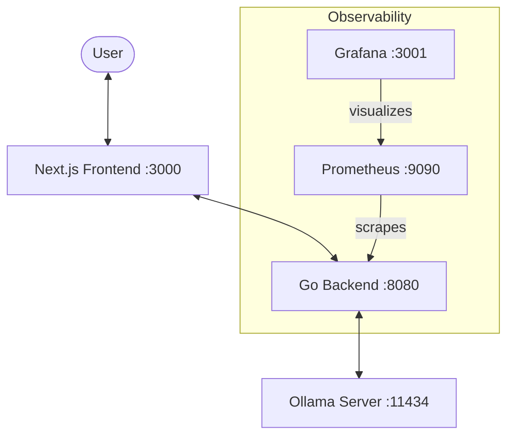

# 🛠️ PromptOps Engine — Developer Guide

> A production-grade orchestration platform for local LLMs, focusing on reliability, observability, and premium aesthetics.

---

## 🏗️ Architecture Overview

The PromptOps Engine is a monorepo consisting of a Go backend, a Next.js frontend, and a local Ollama inference server.

> [!TIP]
> For a more detailed technical explanation including sequence diagrams and data flow, see the **[Architectural Deep Dive](ARCHITECTURE.md)**.



### Core Technologies
- **Backend (Go 1.24)**: High-performance API using `chi` for routing and `slog` for structured logging.
- **Frontend (Next.js 14)**: Premium interface with TypeScript and real-time SSE streaming.
- **Observability**: Native Prometheus instrumentation (`client_golang`) and Request ID tracing (`uuid`).
- **Reliability (Schema Guard)**: JSON Schema enforcement using `gojsonschema`.
- **Inference**: Orchestration of local LLMs via the Ollama REST API.

> [!NOTE]
> For a detailed list of packages and the rationale behind their selection, see the **[Dependency Rationale](ARCHITECTURE.md#dependency--service-rationale)** in the architecture guide.

---

## 📂 Project Structure

```bash
├── backend/                # Go API Server (Refactored)
│   ├── cmd/api/            # Main entry point (main.go)
│   ├── config/             # Environment configuration (DB_URL, JWT_SECRET)
│   ├── handlers/           # HTTP handlers (chat, auth, health)
│   ├── middleware/         # CORS, Logging, Metrics, Auth, UUID
│   ├── pkg/                # Internal packages
│   │   ├── auth/           # JWT & Password utility functions
│   │   ├── db/             # Database initialization & migrations
│   │   ├── models/         # Bun ORM models (User, Chat)
│   │   └── utils/          # Generic utilities
│   └── services/           # Service layer
├── frontend/               # Next.js Web App
│   ├── app/                # App Router (login, register, main page)
│   ├── context/            # React Context (AuthContext)
│   ├── components/         # Components (Sidebar, ChatInput)
│   ├── lib/                # API client
│   └── public/             # Static assets
└── monitoring/             # Monitoring config
```

---

## 🔐 Identity & Access (Week 5)

PromptOps Engine uses a stateless JWT authentication system powered by **Supabase (PostgreSQL)** and **Bun ORM**.

### Setup
1. **Supabase**: Create a project and get the Connection String.
2. **Environment**: Add `DB_URL` and `JWT_SECRET` to your `.env` or Docker secrets.
3. **Migrations**: The engine automatically runs migrations on startup using Bun's migration runner.

### Auth Flow
- **Registration**: `POST /auth/register` creates a user with a hashed password (Bcrypt).
- **Login**: `POST /auth/login` returns a signed JWT.
- **Protection**: Use `middleware.RequireAuth(secret)` to protect specific routes.
- **Context**: Authenticated `user_id` is available in `r.Context()` via `middleware.UserIDKey`.

---

## 🗄️ Database & Migrations

We use **Bun ORM** for its high performance and clean API.

- **Models**: Defined in `backend/pkg/models/models.go` with Bun tags.
- **Migrations**: Located in `backend/pkg/db/migrations/`. 
- **Running**: Migrations are executed automatically in `db.Init()`. To add a new migration, create a new file in the migrations directory and register it.

---

## 🛡️ Schema Guard (Week 2)

PromptOps Engine ensures LLM reliability through **Structured Output Validation**.

1. **Schema Definition**: The frontend provides a JSON Schema.
2. **Strict Validation**: The backend validates the LLM's response using `gojsonschema`.
3. **Automated Retries**: If validation fails, the engine automatically retries (up to 3 times).

---

## 📉 Observability & Tracing (Week 3)

### Structured Logging
Every request is logged as JSON via `slog` and tagged with a unique `request_id` (UUIDv4).

### Metrics Endpoint
Exposed at `:8080/metrics` for Prometheus.
- `promptops_http_requests_total`: Request counts.
- `promptops_ollama_token_usage_total`: Token counts.

---

## 🚀 Development Workflow

### Quick Start (Docker)
```bash
# 1. Configure .env with DB_URL and JWT_SECRET
# 2. Start the full stack
docker compose up --build

# 3. Pull the default model
docker compose exec ollama ollama pull tinyllama
```

### Makefile Commands
- `make backend-run`: Run backend locally (requires `DB_URL`).
- `make frontend-dev`: Run frontend locally.
- `make backend-test`: Run BDD test suite.


---

## ✨ Design Principles
- **Aesthetics First**: Every component must use glassmorphism and emerald/hacker theme.
- **Zero Placeholder**: No generic placeholders; use generated assets or meaningful defaults.
- **Type Safety**: End-to-end TypeScript and Go struct validation.
